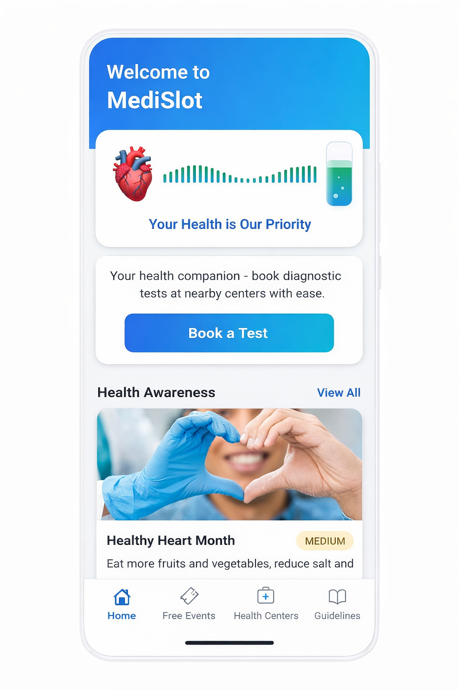
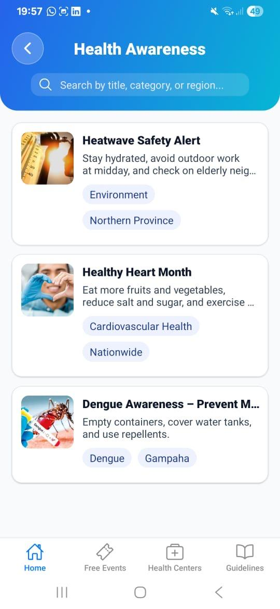
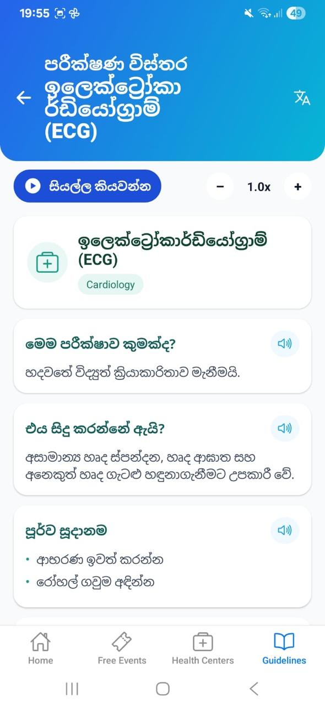
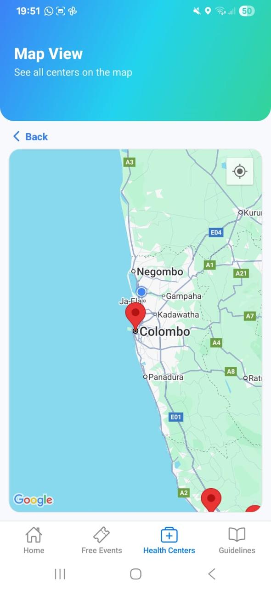
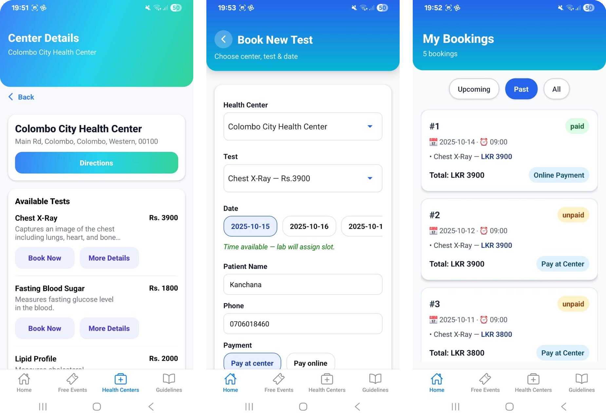
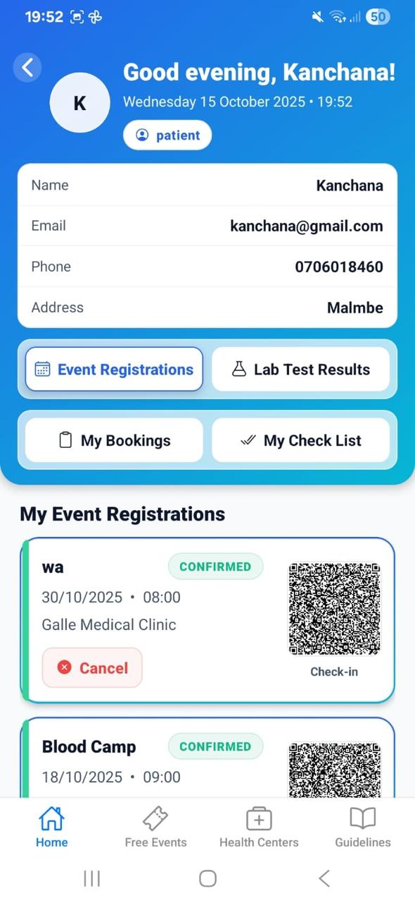

# MediSlot - Smart Health Centre Booking System

Your health companion to discover health centers, book tests, manage appointments, and access guidance in a mobile-first experience.

## Overview

MediSlot is a diagnostic test booking platform built with React Native (Expo). It helps reduce physical queues, booking conflicts, and delays in test/report workflows by offering real-time booking and digital verification.

Developed as part of SLIIT - SE3050 (Case Studies in Software Engineering).

## Key Features

### Patient Module

- Real-time test slot booking
- Health center map view (Google Maps integration)
- Online payment or pay-at-center options
- QR-based booking and report verification
- Booking history (upcoming, past, all)
- Test preparation checklist
- Sinhala/English language toggle
- Health awareness feed and guidelines

### Admin Module

- Manage appointment slots
- Upload lab results
- Monitor bookings
- QR-based check-in verification

## Tech Stack

- React Native
- Expo
- JavaScript (ES6+)
- Express.js
- React Navigation
- Google Maps API

## Problem Solved

MediSlot addresses:

- Long physical queues
- Manual appointment errors
- Lack of real-time slot visibility
- Missing digital verification for bookings/reports
- Accessibility gaps for local-language users

## UX and Research

- 10 user interviews
- 25 survey responses
- 3 field observations
- End-to-end UX flow: brainstorming -> low-fidelity sketches -> Figma wireframes -> high-fidelity prototype -> implementation

## Screenshots

| Screen | Preview |
| --- | --- |
| Home |  |
| Health Awareness Feed |  |
| Multi-language Guidelines |  |
| Health Centers Map |  |
| Book New Test |  |
| My Checklist |  |

## Run Locally

```bash
git clone https://github.com/yourusername/medislot.git
cd medislot
npm install
npx expo start
```

Scan the QR code using Expo Go.
